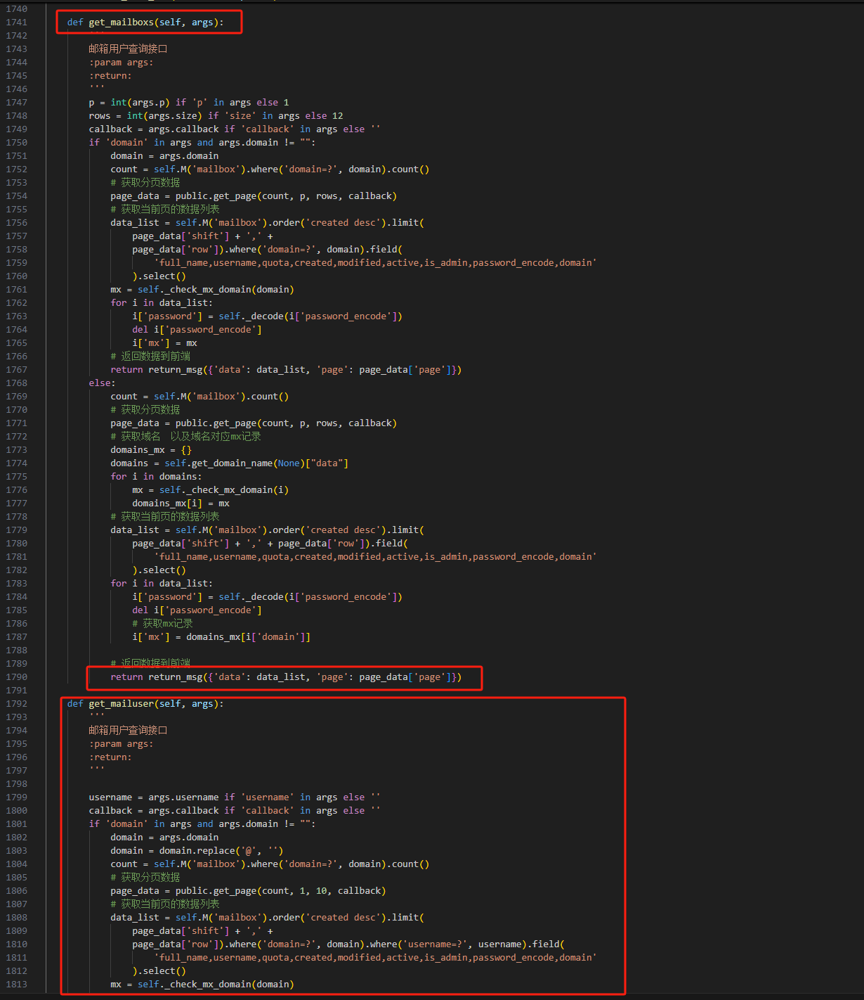

# Baota_MailServer_Plugin
宝塔面板Linux邮局PHP插件补丁  

注意：本项目仅用于学习交流使用，禁止用于非法用途！  
使用本插件、补丁产生的任何法律责任与本人无关，由使用者本人自行承担  
  
学习交流QQ群：757159644 （群文件有配套注册机工具）  
  
1.关于页面显示：  
如果界面无法正常显示内容，请自行修改静态资源调用（原静态资源来自Roundcube Webmail）  

2.关于重置密码：  
由于宝塔api的没有密码校验，只能通过模拟imap登录的方式校验密码  
或者自行修改启用php自带的imap扩展库，代码方案可以直接百度查询  
或者对接Roundcube Webmail进行网页登录验证（推荐使用网页验证）
  
3.额外内容：  
站点nginx配置添加以下规则，可以无需加.php访问  
```
    # 允许访问时省略掉webmail目录下的.php文件后缀  
    location /webmail/ {
      try_files $uri $uri/ $uri.php$is_args$args;
    }
```
/webmail/ 为插件补丁安装路径  
  
2.0版本新增Api模式需要修改邮局文件  
位置：`/www/server/panel/plugin/mail_sys/mail_sys_main.py`  
搜索内容：`get_mailboxs`  
在函数结尾：`return return_msg({'data': data_list, 'page': page_data['page']})`  
添加以下代码（换行，粘贴位置不能有空格或其他字符）：  
```
    def get_mailuser(self, args):
        '''
        邮箱用户查询接口
        :param args:
        :return:
        '''
        
        username = args.username if 'username' in args else ''
        callback = args.callback if 'callback' in args else ''
        if 'domain' in args and args.domain != "":
            domain = args.domain
            domain = domain.replace('@', '')
            count = self.M('mailbox').where('domain=?', domain).count()
            # 获取分页数据
            page_data = public.get_page(count, 1, 10, callback)
            # 获取当前页的数据列表
            data_list = self.M('mailbox').order('created desc').limit(
                page_data['shift'] + ',' +
                page_data['row']).where('domain=?', domain).where('username=?', username).field(
                    'full_name,username,quota,created,modified,active,is_admin,password_encode,domain'
                ).select()
            mx = self._check_mx_domain(domain)
            for i in data_list:
                i['password'] = self._decode(i['password_encode'])
                del i['password_encode']
                i['mx'] = mx
            # 返回数据到前端
            return return_msg({'data': data_list})
        else:
            count = self.M('mailbox').count()
            # 获取分页数据
            page_data = public.get_page(count, 1, 10, callback)
            # 获取域名  以及域名对应mx记录
            domains_mx = {}
            domains = self.get_domain_name(None)["data"]
            for i in domains:
                mx = self._check_mx_domain(i)
                domains_mx[i] = mx
            # 获取当前页的数据列表
            data_list = self.M('mailbox').order('created desc').limit(
                page_data['shift'] + ',' + 
                page_data['row']).where('username=?', username).field(
                    'full_name,username,quota,created,modified,active,is_admin,password_encode,domain'
                ).select()
            for i in data_list:
                i['password'] = self._decode(i['password_encode'])
                del i['password_encode']
                # 获取mx记录
                i['mx'] = domains_mx[i['domain']]
            # 返回数据到前端
            return return_msg({'data': data_list})
```
图片示例：  
